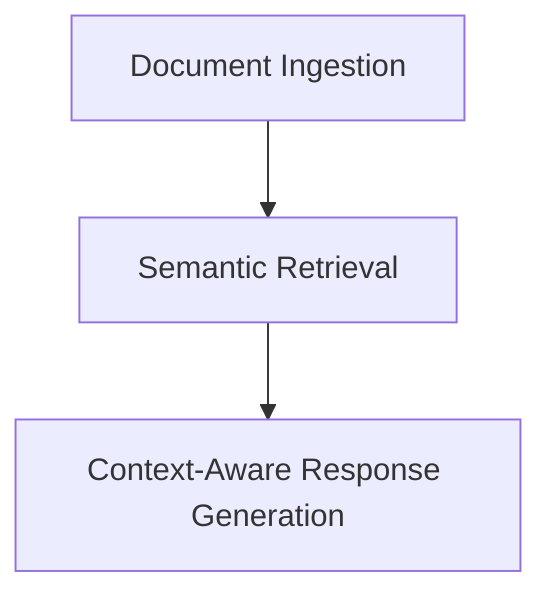

```markdown
<h1 align="center">🧠🔧 Basic RAG Implementations</h1>

<p align="center">
  
  
  
  
  
</p>

---

## 📘 Overview

**Basic_RAGs** contains multiple plug-and-play notebooks that demonstrate how to implement **basic Retrieval-Augmented Generation (RAG)** pipelines using different LLM providers.

This module is next part of RAG's 101 after  [`RAG_pipline_fundamentals`](../RAG_pipline_fundamentals) series — where the RAG concepts like **Ingestion**, **Retrieval**, and **Synthesis (Generation)** were introduced.

---

## 📂 Folder Contents

```bash
Basic_RAGs/
├── .env                           # Local environment variables (excluded via .gitignore)
├── .env.example                   # Template to configure required API keys
├── .gitignore                     # Ensures .env stays private
├── basic_rag_using_groq_api.ipynb        # Groq Cloud - LLaMA 3 inference
├── basic_rag_using_huggingface.ipynb     # HuggingFace hosted/local LLMs
├── basic_rag_using_ollama.ipynb          # Local inference with Ollama
├── basic_rag_using_openai.ipynb          # Current OpenAI chat models
├── basic_rag_using_openai_og.ipynb       # OpenAI legacy/alternate prompt flow
├── requirements.txt              # Install dependencies from here
├── sample.pdf                    # Sample document to run the pipeline
```

---

## 🔄 RAG Workflow (Simplified View)



> Each notebook follows this RAG structure using different LLM providers.

---

## ⚙️ Setup Instructions

### 1. 📦 Install Requirements

```bash
pip install -r requirements.txt
```

### 2. 🔐 Setup `.env` File

```bash
cp .env.example .env
```

Edit `.env` with your API keys and paths for:
- OpenAI
- Groq
- HuggingFace
- Ollama (ensure it is installed and running)

> ✅ Already `.gitignored`, so you don’t accidentally commit secrets.

---

## 📓 Notebook Overview

| Notebook | Backend | Highlights |
|----------|---------|------------|
| `basic_rag_using_groq_api.ipynb` | 🟣 **Groq** | Uses Groq Cloud's ultra-fast LLaMA-3-70B |
| `basic_rag_using_huggingface.ipynb` | 🟠 **HuggingFace** | Local or API-based transformer models |
| `basic_rag_using_ollama.ipynb` | 🟢 **Ollama** | Local models like `phi`, `mistral`, `llama3` using GGUF |
| `basic_rag_using_openai.ipynb` | 🔵 **OpenAI** | Access to `gpt-3.5`, `gpt-4`, or custom instructions |
| `basic_rag_using_openai_og.ipynb` | 🔵 **OpenAI (Legacy)** | Earlier flow or fallback style |

---

## 📄 Use Case

Try with the provided `sample.pdf` or drop in your own to:
- Build RAG over documents
- Switch inference providers easily
- Compare latency, costs, and output quality

---

## 💡 Why This Module?

- Swap backends with ease
- Understand real-world integration challenges
- Learn how LLM provider differences affect RAG quality and performance
- Benchmark LLMs in a plug-and-play way

---

## 🙌 Credits

<p align="center" style="font-size: 13px;">
	Made with ❤️ by <strong>Chirag Bansal</strong> for the open-source AI community.</em>
</p>
```

---
