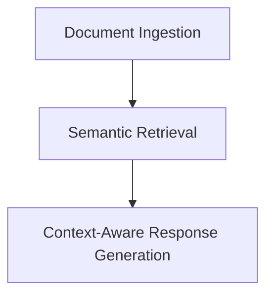

---

<h1 align="center">🧠🔧 Basic RAG Implementations</h1>

<p align="center">
  
  
  
  
  
</p>

---

## 📘 Overview

**Basic_RAGs** is a notebook suite showcasing how to build minimal RAG pipelines using different **LLM providers** — like Groq, HuggingFace, Ollama, and OpenAI.  
It is the **next step after** [`RAG_pipline_fundamentals`](../RAG_pipline_fundamentals), where core concepts like **Ingestion**, **Retrieval**, and **Synthesis (Generation)** were explained.

This module helps you compare how different APIs and inference providers affect your RAG pipeline’s performance and behavior.

---

## 🧱 Folder Structure

```bash
Basic_RAGs/
├── .env                            # Local secrets (ignored by git)
├── .env.example                    # Environment template for API keys
├── .gitignore                      # Ignore .env and cache files
├── basic_rag_using_groq_api.ipynb         # RAG using Groq API (LLaMA-3)
├── basic_rag_using_huggingface.ipynb      # RAG using Hugging Face models
├── basic_rag_using_ollama.ipynb           # Local LLM RAG using Ollama
├── basic_rag_using_openai.ipynb           # RAG using OpenAI (GPT-3.5/4)
├── basic_rag_using_openai_og.ipynb        # Legacy/fallback OpenAI flow
├── requirements.txt               # Python dependencies
├── sample.pdf                     # Example input document
```

---

## 🚀 How It Works

Each notebook follows the same basic flow:

### 1. 🧩 Ingestion  
- Load documents (PDF)  
- Chunk them into overlapping text segments  
- Generate embeddings using chosen model  

### 2. 🔍 Retrieval  
- Convert user query into embedding  
- Search top-K matching document chunks  
- Return context  

### 3. 🧠 Synthesis (Generation)  
- Format prompt with query + context  
- Generate answer using selected LLM backend  

---

## 🔄 RAG Workflow (Simplified View)



---

## 📓 Notebook Breakdown

| Notebook | Backend | Highlights |
|----------|---------|------------|
| `basic_rag_using_groq_api.ipynb` | 🟣 **Groq** | Uses Groq Cloud's ultra-fast LLaMA-3-70B |
| `basic_rag_using_huggingface.ipynb` | 🟠 **HuggingFace** | Local/API-hosted transformer models |
| `basic_rag_using_ollama.ipynb` | 🟢 **Ollama** | Run quantized GGUF models locally |
| `basic_rag_using_openai.ipynb` | 🔵 **OpenAI** | GPT-3.5, GPT-4, and instruction tuning |
| `basic_rag_using_openai_og.ipynb` | 🔵 **OpenAI (Legacy)** | Older OpenAI-style generation setup |

---

## ⚙️ Setup Instructions

### ✅ Step 1: Install dependencies

```bash
pip install -r requirements.txt
```

### ✅ Step 2: Configure environment variables

```bash
cp .env.example .env
```

Then fill in your API keys for:
- OpenAI
- Hugging Face
- Groq
- Ollama (if local)

> `.env` is already in `.gitignore`, so you're safe from leaking credentials.

---

## 📄 Sample Use Case

Use `sample.pdf` or your own documents to:
- Perform PDF-to-knowledge RAG
- Compare inference latency and output quality
- Switch between providers with minimal code changes

---

## 🧠 What You'll Learn

- Differences in LLM behavior across Groq, OpenAI, HF, and Ollama
- How to plug various LLM APIs into the same RAG framework
- How quantized local models compare to cloud-hosted ones

---

## 🧵 Inspired By

- [RAG: Retrieval-Augmented Generation (Meta)](https://arxiv.org/pdf/2005.11401.pdf)
- [OpenAI API](https://platform.openai.com/)
- [Hugging Face Transformers](https://huggingface.co/)
- [GroqCloud](https://console.groq.com/)
- [Ollama](https://ollama.com/)

---

## 🤝 Contributing

Feel free to submit PRs, bug reports, or ideas!  
This repo is designed as a flexible **learning-first sandbox** 🔬

---

## 🧑‍💻 Author

**Chirag Bansal**

🔗 [LinkedIn](https://www.linkedin.com/in/chiragb254)  
🐦 [Twitter/X](https://twitter.com/ChiragB254)  
📝 [Medium](https://medium.com/@ChiragB254)  
📷 [Instagram](https://instagram.com/data.scientist_chirag)  
📧 [Email](mailto:devchirag27@gmail.com)  
💻 [GitHub](https://github.com/ChiragB254)

---

<p align="center" style="font-size: 13px; color: black; font-style: italic;">
  <strong>Made with ❤️ by Chirag Bansal</strong> for the open-source AI community.
</p>