<h1 align="center">🔍🧠 RAG Pipeline Fundamentals</h1>
<p align="center">
  
  
  
  
</p>

---

## 📘 Overview

**RAG_PIPLINE_FUNDAMENTALS** is a modular and beginner-friendly notebook suite demonstrating how to build a complete **Retrieval-Augmented Generation (RAG)** pipeline from scratch using:

- ✅ FAISS for vector storage
- ✅ Custom document chunking & ingestion
- ✅ Semantic retrieval
- ✅ End-to-end synthesis/generation

Perfect for learning or deploying your own knowledge-enhanced LLMs!

---

## 🧱 Folder Structure

```bash
RAG_PIPLINE_FUNDAMENTALS/
├── my_faiss_index/                # Stored FAISS vector index
├── .env                           # Environment variables
├── .env.example                   # Template for environment setup
├── .gitignore                     # Files to ignore in version control
├── requirements.txt              # Required Python libraries
├── sample.pdf                     # Sample input document for the pipeline
├── Ingestion.ipynb                # Chunking + embedding creation
├── Retrieval.ipynb                # Semantic document retrieval
├── Synthesis(Genration).ipynb     # Response generation from context
```

---

## 🚀 How It Works

### 1. 🧩 Ingestion

- Split documents into clean, overlapping chunks
- Generate embeddings (e.g., using OpenAI or Hugging Face models)
- Store in a FAISS vector index

### 2. 🔍 Retrieval

- Accept user query
- Embed query and search for top-K most relevant chunks
- Return relevant source documents for grounding

### 3. 🧠 Synthesis (Generation)

- Assemble retrieved chunks into context
- Format prompt and feed into LLM (GPT, Mistral, etc.)
- Generate final answer from grounded knowledge

---


## 🔄 Workflow

```mermaid
graph LR
    A[📥 Ingestion] --> B[🔍 Retrieval]
    B --> C[🧠 Synthesis/Generation]
```


---

## 📂 Notebooks Explained

| Notebook | Purpose |
|----------|---------|
| `Ingestion.ipynb` | Chunk documents & create vector embeddings |
| `Retrieval.ipynb` | Retrieve semantically similar chunks |
| `Synthesis(Genration).ipynb` | Generate final response using context |

---

## 🧪 Requirements

Install dependencies using:

```bash
pip install -r requirements.txt
```

Don't forget to create a `.env` file based on `.env.example` to store API keys and config values.

---

## 📄 Sample Use Case

Use `sample.pdf` or your own documents to experiment with:
- Semantic search
- Query answering
- PDF-to-knowledge extraction

---

## 🧠 What You'll Learn

- How RAG systems enhance LLMs with external knowledge
- The role of embeddings, vector search, and prompt engineering
- Fine-grained control over each RAG pipeline stage

---

## 🧵 Inspired By

- [RAG: Retrieval-Augmented Generation](https://arxiv.org/pdf/2005.11401.pdf)
- [LangChain (conceptual influence, no dependency)](https://www.langchain.com/)
- OpenAI & Hugging Face Embedding APIs
- FAISS for efficient vector search

---

## 🤝 Contributing

Pull requests, feedback, and suggestions are welcome! This repo is a learning-first playground 🌱

---

## 🧑‍💻 Author

**Chirag Bansal**  

🔗 [LinkedIn](https://www.linkedin.com/in/chiragb254)  
🐦 [Twitter/X](https://twitter.com/ChiragB254)  
📝 [Medium](https://medium.com/@ChiragB254)  
📷 [Instagram](https://instagram.com/data.scientist_chirag)  
📧 [Email](mailto:devchirag27@gmail.com)  
💻 [GitHub](https://github.com/ChiragB254)

---

  <p style="font-size: 13px; color: black; font-style: italic; margin-top: 8px;">
    <strong>Made with ❤️ by Chirag Bansal</strong>
  </p>
