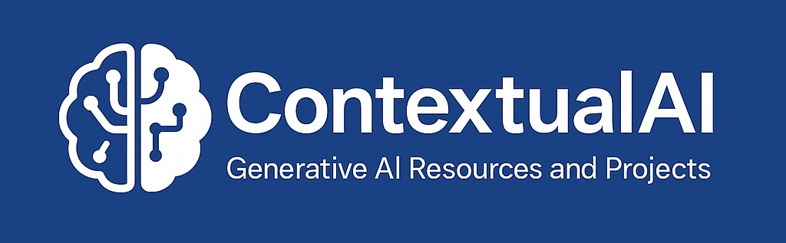

  

<h1 align="center">🧠 ContextualAI</h1>

<i>Your Gateway to Generative AI and Beyond</i>

  
  
  
  

---

## 🚀 What's Inside?

- 🎓 **Concepts & Fundamentals**  
  Dive into core topics like Transformers, Diffusion Models, Vector Embeddings, RAG, and more.

- 🛠️ **Hands-on Projects**  
  Jupyter notebooks, prototypes, and real-world GenAI use cases.

- 📚 **Learning Resources**  
  Curated lists of must-read papers, tutorials, and tools to level up your AI game.

- 🧩 **Components & Architectures**  
  Breakdown of modern GenAI systems: LLMs, prompt engineering, vector databases, orchestration layers, etc.

- 🌐 **Explainers for Everyone**  
  Simple and intuitive explanations aimed at making GenAI accessible to all.

---

## 💡 Why ContextualAI?

Because context is everything. In the GenAI era, understanding how models use and generate context is key to building smarter, safer, and more capable systems. This repo is your guide to mastering that.

---

## 📦 Examples

| Topic | Description |
|------|-------------|
| `RAG-Explained.ipynb` | Step-by-step intro to Retrieval-Augmented Generation |
| `vector-databases.md` | Guide to choosing the right vector DB for your project |
| `prompt-engineering/` | *(Coming soon)* Prompting strategies, templates & hacks |
| `open-source-llms.md` | *(Coming soon)* Explore powerful open-source LLMs |

---

## 🧭 Roadmap

📌 *Coming Soon* – Stay tuned for exciting updates:

- LangChain & LlamaIndex walkthroughs  
- Multi-modal GenAI examples  
- Agent-based systems  
- Real-time GenAI app demos  

---

## 🌍 Join the Journey

This is a living project — contributions, questions, and feedback are all welcome!

- ⭐ Star the repo if you find it helpful  
- 🧵 Open an issue or discussion to share ideas  
- 🔧 PRs are more than welcome  

---

## 📬 Stay in Touch

Let’s connect and grow together in the GenAI space:

- 🐦 [Twitter (X)](https://twitter.com/ChiragB254)  
- 💼 [LinkedIn](https://linkedin.com/in/ChiragB254)  
- ✍️ [Medium](https://medium.com/@ChiragB254)  
- 📸 [Instagram](https://instagram.com/data.scientist_chirag)

---
